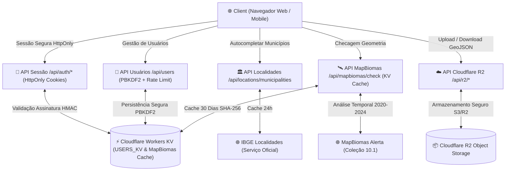

# 🌿 Preparador EUDR — FAF Coffees

> Plataforma web corporativa para preparação, validação e gestão automatizada de dossiês de conformidade do **Regulamento Europeu de Desmatamento (EUDR - Regulamento UE 2023/1115)**.

---

## 📌 Visão Geral

O **Preparador EUDR** transforma geometrias de talhões agrícolas (formatos **KML, GeoJSON ou JSON**) em pacotes auditáveis completos para o ecossistema de exportação de café, integrando:
* Validação de série temporal de uso do solo com o **MapBiomas (Coleção 10.1, 2020–2024)** com cache determinístico no Cloudflare KV.
* Reprojeção automática de coordenadas métricas **SIRGAS 2000 / UTM (Zonas 21S a 25S)** para graus decimais **WGS84 (EPSG:4326)**.
* Dados oficiais de municípios do **IBGE**.
* Repositório em nuvem de alta disponibilidade no **Cloudflare R2** com portal exclusivo para clientes e importadores.
* Autenticação de sessão de nível enterprise via **Cookies HttpOnly, Secure e SameSite=Strict** assinados com **HMAC-SHA256** e senhas com hash **PBKDF2-SHA512 (100.000 iterações)**.

---

## 📐 Arquitetura do Sistema



---

## 🔄 Fluxo de Processamento EUDR

```mermaid
sequenceDiagram
    autonumber
    actor Usuário
    participant App as Preparador EUDR (Web)
    participant Auth as Sessão /api/auth/login
    participant RDP as Douglas-Peucker & Reprojeção UTM
    participant IBGE as IBGE API
    participant MB as MapBiomas (com Cache KV)
    participant R2 as Cloudflare R2

    Usuário->>Auth: 1. Login com PBKDF2-SHA512
    Auth-->>App: 2. Emite Cookie HttpOnly; Secure; SameSite=Strict
    Usuário->>App: 3. Importa Geometria (KML / GeoJSON / UTM SIRGAS 2000)
    App->>RDP: 4. Reprojeção para WGS84 & Otimização de Densidade
    RDP-->>App: Geometria Normalizada EPSG:4326 com Anéis Fechados
    Usuário->>App: 5. Seleciona Município (IBGE)
    App->>MB: 6. Consulta Série Temporal (com verificação de hash SHA-256 no KV)
    MB-->>App: Tabela de Cobertura por Classe & Link de Verificação
    App->>Usuário: 7. Exibe Conformidade EUDR
    Usuário->>App: 8. Solicita Pacote EUDR Final ou Publicação Cloud
    App->>R2: Armazena GeoJSON e vincula ao contrato
    App-->>Usuário: Download do ZIP (GeoJSON + Shapefile 5 partes + Planilha Excel)
```

---

## ⚡ Principais Funcionalidades

- 🗺️ **Importação Multiformato & Reprojeção**: Suporte a KML, GeoJSON, JSON e coordenadas projetadas **UTM Zonas 21S a 25S (SIRGAS 2000)** convertidas automaticamente para WGS84 decimal.
- 📐 **Cálculo de Área de Precisão**: Cálculo geodésico de área em hectares com precisão de duas casas decimais, suportando polígonos complexos com múltiplos anéis e furos (*donuts*).
- 🪄 **Simplificação Geométrica Inteligente**: Algoritmo **Ramer-Douglas-Peucker** integrado para reduzir a contagem de vértices em polígonos densos sem perda de fidelidade cartográfica.
- 🏛️ **Autocompletar IBGE**: Busca inteligente de municípios brasileiros com preenchimento automático de UF e Microrregião.
- 🛰️ **Validação MapBiomas com Cache KV**: Consulta automatizada da série temporal de cobertura vegetal (2020 a 2024, Coleção 10.1) com cache determinístico no Cloudflare KV (30 dias de TTL) para respostas instantâneas (~50ms).
- 🍪 **Sessão Segura por Cookies `HttpOnly`**: Token assinado com HMAC-SHA256 gravado em cookies `HttpOnly; Secure; SameSite=Strict; Path=/`, eliminando vulnerabilidades a ataques XSS.
- 🔐 **PBKDF2-SHA512 Password Hashing**: Hashing com 100.000 iterações e Salt criptográfico de 16 bytes no formato `pbkdf2:100000:<salt>:<hash>`, com suporte retroativo a hashes legados.
- 🛑 **Rate Limiting em Autenticação**: Proteção contra força bruta em `/api/users` com limite de requisições, headers `Retry-After` e resposta `HTTP 429`.
- ☁️ **Integração Cloudflare R2**: Armazenamento e download de GeoJSONs organizados por contratos e lotes de exportação com portal do cliente.
- 📦 **Exportação em Lote**: Geração com 1 clique de pacote ZIP contendo **GeoJSON**, **Shapefile (.shp, .shx, .dbf, .prj, .cpg)** e **Planilha Excel (.xlsx) de Cadastro**.
- 📄 **Especificação OpenAPI 3.1**: Documentação completa da API disponível em [`public/openapi.yaml`](./public/openapi.yaml).

---

## 🏗️ Estrutura do Projeto

```
├── app/
│   ├── api/
│   │   ├── auth/            # Endpoints de Sessão HttpOnly (/login, /logout, /me)
│   │   ├── users/           # Gestão de usuários com PBKDF2 e Rate Limiting
│   │   ├── mapbiomas/check/ # Consulta MapBiomas com cache KV SHA-256
│   │   ├── gfw/check/       # Consulta Global Forest Watch
│   │   ├── locations/       # Autocompletar IBGE
│   │   ├── r2/              # Operações de Cloud Storage (Upload, Download, Publish, List, Delete)
│   │   └── logs/            # Registro e consulta de logs de auditoria
│   ├── components/          # Componentes visuais modulares
│   │   ├── admin/           # Subcomponentes do painel ADM
│   │   ├── LandingPage.tsx  # Portal de entrada tipográfico
│   │   ├── ContractManagerView.tsx # Gestão de contratos e lotes
│   │   ├── ClientPortalModal.tsx   # Portal do cliente e importadores
│   │   ├── ExecutiveDashboardView.tsx # Dashboard analítico
│   │   ├── EudrHeader.tsx
│   │   ├── EudrStepsNav.tsx
│   │   └── LoginScreen.tsx
│   ├── hooks/               # Custom Hooks (useUserManagement, useTheme)
│   ├── lib/                 # Biblioteca Core (eudr.ts, auth.ts, r2.ts, auditLogger.ts)
│   └── page.tsx             # Aplicação principal
├── public/
│   └── openapi.yaml         # Especificação OpenAPI 3.1 (Swagger)
├── tests/                   # 21 testes unitários automatizados (Node.js Test Runner)
└── wrangler.json            # Configuração de bindings do Cloudflare Workers & KV
```

---

## 💻 Desenvolvimento & Execução

### Requisitos

- **Node.js**: v22 ou superior
- **Gerenciador de Pacotes**: `npm` ou `pnpm`

### Instalação

```bash
npm install
```

### Executar em Modo de Desenvolvimento

```bash
npm run dev
```

### Executar Suíte de Testes Automatizados (21 testes)

```bash
npm run test
```

### Compilar para Produção

```bash
npm run build
```

### Deploy no Cloudflare Workers

```bash
npm run deploy
```

---

## 🛡️ Segurança e Conformidade

- **Sessão Enterprise**: Proteção por Cookies `HttpOnly` que impede o acesso via JavaScript e protege contra sequestro de sessão (*session hijacking*).
- **Criptografia de Senhas**: Hashes derivados com algoritmo PBKDF2-HMAC-SHA512 (100.000 rounds) e salt de 128 bits gerado por `crypto.getRandomValues`.
- **Prevenção de Timing Attacks**: Verificação de credenciais e tokens em tempo constante (`constantTimeEqual`).
- **Rate Limiting**: Mitigação de ataques de força bruta no endpoint de usuários.
- **Auditoria Contínua**: Registro de ações críticas (Login, Logout, Upload, Exportação, Alteração de Senha) persistido em Cloudflare KV com exportação em CSV auditável.

---

## ⚖️ Limites da Automação

O sistema utiliza a Série Temporal de Cobertura da Coleção 10.1 do MapBiomas (dados até 2024). A validação automática destaca alterações de cobertura vegetal entre anos consecutivos, atuando como ferramenta de apoio à decisão. **A validação documental e análise do CAR continuam sendo etapas humanas obrigatórias para auditoria final.**
