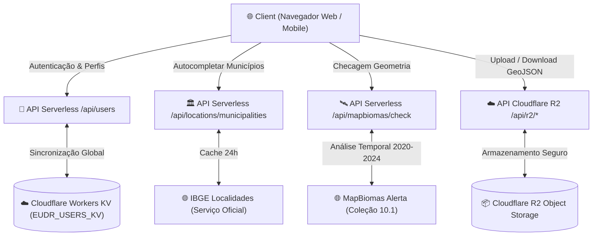
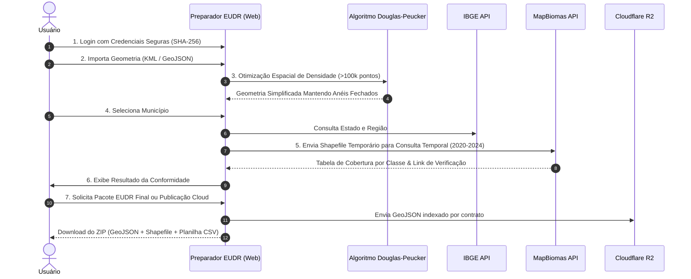

# 🌿 Preparador EUDR — FAF Coffees

> Plataforma web para preparação, validação e gestão automatizada de dossiês de conformidade do **Regulamento Europeu de Desmatamento (EUDR)**.

---

## 📌 Visão Geral

O **Preparador EUDR** permite transformar geometrias de propriedades agrícolas (formatos **KML, GeoJSON ou JSON**) em pacotes auditáveis completos para o ecossistema EUDR, integrando validação de série temporal de uso do solo com o **MapBiomas (Coleção 10.1, 2020–2024)**, dados oficiais do **IBGE**, repositório de nuvem **Cloudflare R2** e portal do cliente para importadores.

---

## 📐 Arquitetura do Sistema



---

## 🔄 Fluxo de Processamento EUDR



---

## ⚡ Principais Funcionalidades

- 🗺️ **Importação de Geometrias**: Suporte nativo a arquivos KML, GeoJSON e JSON.
- 📐 **Cálculo de Área de Precisão**: Cálculo geodésico de área em hectares com precisão de duas casas decimais.
- 🪄 **Simplificação Geométrica Inteligente**: Algoritmo **Ramer-Douglas-Peucker** integrado em `app/lib/eudr.ts` para reduzir automaticamente polígonos gigantescos mantendo a fidelidade espacial.
- 🏛️ **Autocompletar IBGE**: Busca inteligente por municípios com preenchimento automático de Estado e Região.
- 🛰️ **Validação MapBiomas**: Consulta automática da série temporal de cobertura vegetal classe a classe (2020 a 2024) via Coleção 10.1 (resolução 30m).
- 🔐 **Autenticação Global & Cloudflare KV**: Sincronização Serverless de credenciais e permissões (ADM / Usuário Padrão / Cliente) via Cloudflare Workers KV em tempo real.
- ☁️ **Integração Cloudflare R2**: Armazenamento e download de GeoJSONs organizados por contratos e lotes.
- 📦 **Exportação em Lote**: Geração com 1 clique de pacote ZIP contendo **GeoJSON**, **Shapefile (.shp, .shx, .dbf, .prj, .cpg)** e **Planilha Excel/CSV de Cadastro**.

---

## 🏗️ Estrutura do Projeto

```
├── app/
│   ├── api/                 # Endpoints Serverless (MapBiomas, IBGE, R2, Users KV, Logs)
│   ├── components/          # Componentes visuais modulares
│   │   ├── admin/           # Subcomponentes do painel ADM
│   │   ├── LandingPage.tsx  # Portal de entrada tipográfico
│   │   ├── ContractManagerView.tsx # Gestão de contratos e lotes
│   │   ├── ClientPortalModal.tsx   # Portal do cliente e importadores
│   │   ├── ExecutiveDashboardView.tsx # Dashboard analítico
│   │   ├── EudrHeader.tsx
│   │   ├── EudrStepsNav.tsx
│   │   └── LoginScreen.tsx
│   ├── hooks/               # Custom Hooks (useUserManagement, useTheme)
│   ├── lib/                 # Biblioteca de Geometria, Algoritmos, R2 e Configurações (eudr.ts, r2.ts, config.ts)
│   └── page.tsx             # Aplicação principal
├── tests/                   # Suíte de testes automatizados com Node.js Test Runner
└── wrangler.json            # Configuração de bindings do Cloudflare Workers & KV
```

---

## 💻 Desenvolvimento & Execução

### Requisitos

- **Node.js**: v22 ou superior
- **Gerenciador de Pacotes**: `pnpm` ou `npm`

### Instalação

```bash
npm install
```

### Executar em Modo de Desenvolvimento

```bash
npm run dev
```

### Executar Suíte de Testes Automatizados

```bash
npm run test
```

### Compilar para Produção

```bash
npm run build
```

### Deploy no Cloudflare Workers

```bash
npm run deploy
```

---

## 🛡️ Segurança e Privacidade

- **Armazenamento de Senhas**: As senhas de usuários utilizam hash **SHA-256** com *salt* exclusivo do sistema antes de qualquer armazenamento local ou remoto.
- **Proteção dos Dados**: As geometrias são processadas localmente e enviadas via conexões seguras HTTPS diretamente aos endpoints públicos do MapBiomas sem retenção de dados sensíveis em servidores externos desnecessários.

---

## ⚖️ Limites da Automação

O sistema utiliza a Série Temporal de Cobertura da Coleção 10.1 do MapBiomas (dados até 2024). A validação automática destaca alterações de cobertura vegetal entre anos consecutivos, atuando como ferramenta de apoio à decisão. **A validação documental e análise do CAR continuam sendo etapas humanas obrigatórias.**
